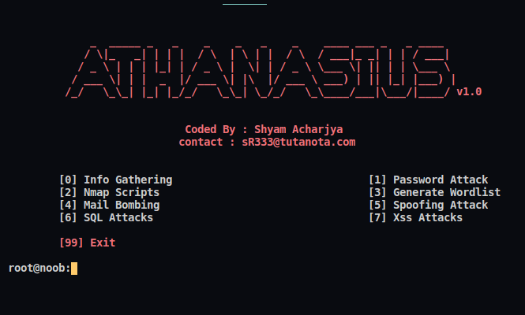
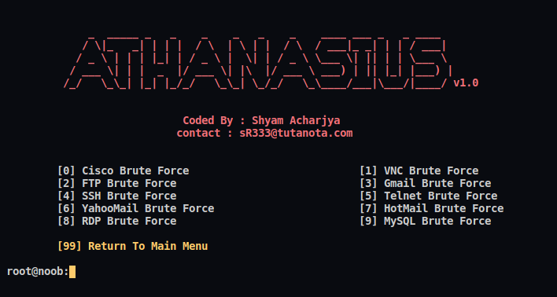

# Athanasius Hacking Framework

[](https://app.codacy.com/manual/shyam.acharjya.1/Athanasius?utm_source=github.com&utm_medium=referral&utm_content=shyam999/Athanasius&utm_campaign=Badge_Grade_Dashboard)

> Hacking Tool Built In Python
## Installation:


**1.Clone Repo**
```sh
git clone https://github.com/shyam999/Athanasius.git
```
**2.Install Requirements**
```sh
pip install -r requirements.txt
```
**3.Run The Script**
```sh
python athanasius.py
```
# Screenshots:
## Main Menu:

## Nmap Scrips:

## Password Attacks:


## Where to find Me

Like Me on [Facebook](https://www.facebook.com/shyam333445/)


Or visit My [Website](#)
